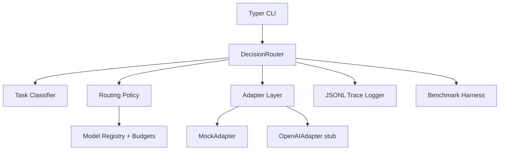

# ai-decision-router

[](https://github.com/your-org/ai-decision-router/actions/workflows/ci.yml)

A production-ready Python framework that routes prompts to the best LLM based on **quality, latency, and cost constraints**.

## Quickstart

```bash
python -m pip install -e .[dev]
router run "Write a Python function to detect palindromes"
router explain "Summarize this article in executive style"
router bench --suite quick
```

By default, all commands run offline with `MockAdapter`.

## Architecture



## CLI examples

### Route and execute
```bash
router run "Debug this Python function and explain the bug"
```

### Explain route decision
```bash
router explain "Analyze this SQL table and suggest an index strategy"
```

### Run benchmark
```bash
router bench --suite quick
router bench --suite medium
```

## Configuration (`router.toml`)

```toml
default_adapter = "mock"
enable_cache = true

[budgets]
max_cost_usd = 0.05
max_latency_ms = 2500

[policy]
name = "score"
quality_weight = 0.6
cost_weight = 0.2
latency_weight = 0.2

[trace]
enabled = true
output_path = "traces/router_traces.jsonl"

[[model_registry]]
name = "mock-fast"
provider = "mock"
expected_quality = 0.68
expected_cost_per_1k_tokens = 0.001
expected_latency_ms = 180

[[model_registry]]
name = "mock-balanced"
provider = "mock"
expected_quality = 0.80
expected_cost_per_1k_tokens = 0.003
expected_latency_ms = 500
```

See a full sample at `examples/router.toml`.

## Environment variables

- `OPENAI_API_KEY`: required to enable `OpenAIAdapter`.
- `OPENAI_BASE_URL`: optional override (defaults to `https://api.openai.com/v1`).

## Project layout

- `src/ai_decision_router/`: core package (router, policies, adapters, tracing, CLI).
- `tests/`: pytest suite.
- `benchmarks/`: quick and medium benchmark prompt suites.
- `reports/`: generated benchmark artifacts (gitignored).
- `.github/workflows/ci.yml`: CI for lint + tests.

## Development

```bash
make setup
make fmt
make lint
make test
make bench
```

## Phase 2 roadmap

- Real provider integrations (OpenAI, Anthropic, local vLLM) with retries and streaming.
- Learned routing policy and online feedback loop.
- Distributed tracing exporters (OTel) and dashboard UI.
- Dataset-driven benchmark packs with domain-specific quality metrics.
